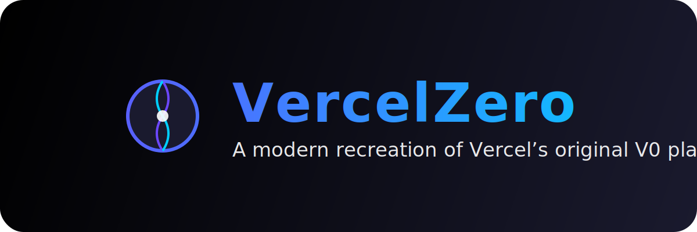
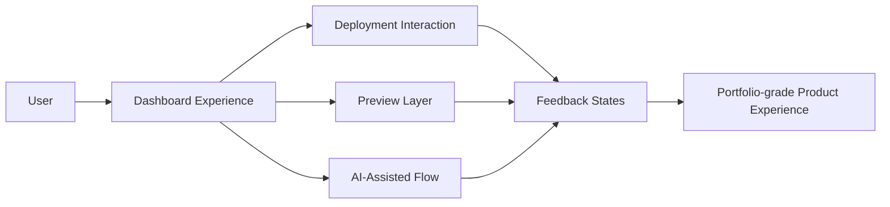
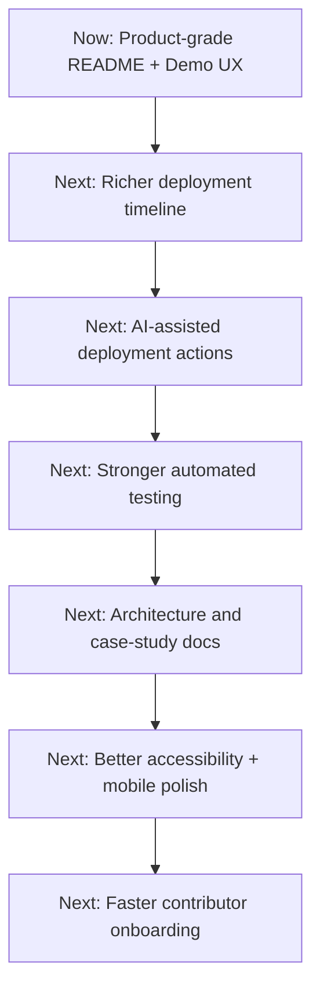

# ▲ VercelZero

<div align="center">
  

  <h1>An open-source product experience designed to communicate clarity, quality, and modern business value. </h1>

  <p>
    <strong>VercelZero</strong> is an open-source platform inspired by the early Vercel experience — created to showcase
    modern frontend architecture, deployment UX, AI-assisted workflows, and public-facing product thinking in one repository.
  </p>

  <p>
    <a href="https://vercel-zero-01.vercel.app/"><strong>Live Demo</strong></a>
    ·
     <a href="#english"><strong>English</strong></a>
    ·
    <a href="#pt-br"><strong>PT-BR</strong></a>
    ·
    <a href="#feature-matrix"><strong>Feature Matrix</strong></a>
    ·
    <a href="#why-this-repo-is-recruiter-bait"><strong>Recruiter Bait</strong></a>
    ·
    <a href="#visual-roadmap"><strong>Roadmap</strong></a>
  </p>

  <p>
     <a href="docs/launch-kit.md"><strong>Launch Kit Pitch</strong></a>
    ·
    <a href="docs/recruiter-pitch.md"><strong>Recruiter Pitch</strong></a>
    ·
    <a href="docs/social-posts.md"><strong>Social Posts</strong></a>
  </p>

  <p>
    <a href="https://github.com/DaveSimoes/VercelZero/stargazers">
      
    </a>
    <a href="https://github.com/DaveSimoes/VercelZero/network/members">
      
    </a>
    <a href="LICENSE">
      
    </a>
    <a href="CONTRIBUTING.md">
      
    </a>
  </p>
</div>

---

## English

### Why VercelZero matters

Most public repositories are either visually attractive or technically interesting.

**VercelZero is designed to be both.**

This project exists to feel like a real software product instead of a disconnected interface exercise. It is built to communicate:

- strong product judgment;
- modern frontend architecture;
- deployment-platform UX thinking;
- AI-native interaction potential;
- open-source credibility.

If a recruiter, contributor, or developer lands here for the first time, the goal is simple:

> **“This feels like a real product with real intent.”**

---

<!-- ### Real README GIF


This GIF is intentionally referenced directly in the repository so the README already ships with a usable visual asset instead of a missing placeholder.

--- -->

### 15-second pitch

**VercelZero** is an open-source, portfolio-grade deployment-platform experience built with Next.js, TypeScript, Tailwind, CopilotKit, and OpenAI.

It is meant to show how a modern SaaS interface can be:

- polished enough for public sharing;
- structured enough for technical discussion;
- clear enough for recruiter evaluation;
- open enough for contributors to extend.

---

### Feature matrix

## Feature Matrix

| Capability | Typical demo repo | Strong portfolio repo | VercelZero |
| --- | --- | --- | --- |
| Polished visual presentation | Yes | Yes | Yes |
| Product-style interface instead of isolated pages | Rarely | Sometimes | Yes |
| Useful for interview discussion | Sometimes | Yes | Yes |
| AI-assisted workflow angle | Rarely | Sometimes | Yes |
| Easy to extend publicly | Sometimes | Yes | Yes |
| Strong README conversion potential | Rarely | Sometimes | Yes |
| Contributor onboarding potential | Often weak | Good | Yes |
| Suitable as a recruiter-facing flagship repo | Rarely | Sometimes | Yes |

---

# Launch Kit

Use this file as the public distribution pack for promoting VercelZero across GitHub, LinkedIn, X, portfolio pages, and recruiter conversations.

---

## 1. Positioning

### Short positioning

VercelZero is an open-source, portfolio-grade deployment platform experience inspired by the early Vercel UX, built to showcase product thinking, frontend architecture, AI-assisted workflows, and public-facing engineering quality.

### One-line description

An open-source deployment-platform case study built to feel like a real product.

### Expanded description

VercelZero is a product-first frontend project that explores how a modern deployment platform can be designed, presented, and evolved in public. It combines polished UI, product-style flows, AI-assisted interactions, and open-source storytelling into a repository that is intentionally attractive to contributors and international recruiters.

---

## 2. Launch copy

### GitHub release / launch post

Today I’m sharing **VercelZero** — an open-source, portfolio-grade platform inspired by the early Vercel experience.

I wanted to build something that felt closer to a real product than a typical frontend demo: cleaner UX, stronger architecture intent, AI-assisted workflows, and a README that communicates the project as publicly as the code itself.

What’s inside:
- deployment-inspired product UX;
- product-oriented frontend architecture;
- AI-ready interaction patterns;
- bilingual README and public presentation assets;
- a repository designed to be useful for contributors and visible to recruiters.

If you enjoy product-focused frontend engineering, open-source case studies, or modern SaaS UX, I’d love your feedback.

**Repo:** https://github.com/DaveSimoes/VercelZero

### Product Hunt / showcase variant

VercelZero is an open-source product experience inspired by the early Vercel feel — built to demonstrate how a deployment platform can be designed with strong UX, frontend architecture, and AI-assisted interaction patterns.

---

## 3. Where to use the assets

- `assets/social-linkedin.svg` → LinkedIn announcement image.
- `assets/social-x.svg` → X/Twitter post image.
- `assets/social-og.svg` → Open Graph / site preview / press-card style use.
- `assets/vercelzero-readme-demo.gif` → README hero motion asset.

---

## 4. Suggested CTA order

1. Watch the README GIF.
2. Open the live demo.
3. Read the feature matrix.
4. Review the recruiter pitch.
5. Star the repository.
6. Share the project publicly.

---

## 5. Metrics to watch during launch

- GitHub stars.
- README click-through rate to live demo.
- Demo visits.
- Stars per social post.
- Recruiter/profile views after launch week.
- Inbound issues or contributor interest.


---

## Why this repo is recruiter bait

Because it exposes exactly the kind of signals hiring teams notice quickly:

- product thinking;
- architecture awareness;
- UI quality;
- communication clarity;
- engineering taste;
- portfolio strategy;
- ability to present work publicly, not just build it privately.

### Recruiter evaluation path

1. Open the live demo.
2. Watch the README GIF.
3. Scan the feature matrix.
4. Review the architecture and roadmap.
5. Inspect the codebase and contribution surface.

### Recruiter takeaway

> Can this developer design, build, present, and evolve a product-grade frontend experience?

VercelZero is intended to answer that question with a visible **yes**.

---

### Architecture



**Architecture priorities**

- clear product surfaces;
- maintainable UI composition;
- extensibility for future docs, tests, and features;
- strong public presentation value.

---

### Visual roadmap

## Visual Roadmap



---

### Quick Start

#### 1. Clone the repository

```bash
git clone https://github.com/DaveSimoes/VercelZero.git
cd VercelZero
```

#### 2. Install dependencies

```bash
npm install
```

#### 3. Configure environment variables

Create a `.env.local` file in the project root.

| Variable | Description | Required |
| --- | --- | --- |
| `OPENAI_API_KEY` | API key used by OpenAI-powered features | Yes |

#### 4. Start the development server

```bash
npm run dev
```

Open [http://localhost:3000](http://localhost:3000).

---

### Scripts

```bash
npm run dev        # Start the development server
npm run build      # Create the production build
npm run start      # Start the production server
npm run lint       # Run ESLint
npm run typecheck  # Run TypeScript checks
npm run format     # Format supported files with Prettier
```

---

### Contributing

Contributions are welcome.

Before opening a pull request:

- read the [Contributing Guide](CONTRIBUTING.md);
- follow the [Code of Conduct](CODE_OF_CONDUCT.md);
- use the templates in [`.github/`](.github/);
- keep pull requests focused and easy to review.

Good places to contribute:

- UI polish;
- docs and architecture notes;
- tests and CI;
- accessibility;
- deployment-flow realism;
- AI-assisted workflow improvements.

---

## PT-BR

### Por que o VercelZero importa

A maioria dos repositórios públicos consegue ser ou visualmente bonita ou tecnicamente interessante.

**O VercelZero foi pensado para ser os dois ao mesmo tempo.**

Este projeto existe para parecer um produto de software real, e não apenas uma interface solta. Ele busca comunicar:

- visão de produto;
- arquitetura frontend moderna;
- UX inspirada em plataformas de deploy;
- potencial para interações com IA;
- credibilidade open source.

Se um recrutador, contribuidor ou desenvolvedor chegar aqui pela primeira vez, o objetivo é simples:

> **“Isto parece um produto real, feito com intenção.”**

---

### Pitch em 15 segundos

**VercelZero** é uma experiência open source, em nível de portfólio, inspirada em plataformas modernas de deploy e construída com Next.js, TypeScript, Tailwind, CopilotKit e OpenAI.

Ele foi feito para mostrar como uma interface SaaS moderna pode ser:

- bonita o suficiente para ser compartilhada publicamente;
- estruturada o suficiente para discussão técnica;
- clara o suficiente para avaliação de recrutadores;
- aberta o suficiente para receber contribuições.

---

### Por que este repositório chama atenção de recrutadores

Porque ele expõe rapidamente sinais que times de contratação valorizam:

- product thinking;
- senso de arquitetura;
- qualidade visual;
- clareza de comunicação;
- maturidade de portfólio;
- capacidade de apresentar trabalho em público.

---

### Roadmap visual

O roadmap acima resume bem a direção do projeto:

- melhorar a timeline de deploy;
- aprofundar as ações assistidas por IA;
- fortalecer testes automatizados;
- publicar documentação de arquitetura e case study;
- elevar acessibilidade, mobile e onboarding de contribuidores.

---

### Começo rápido

#### 1. Clonar o repositório

```bash
git clone https://github.com/DaveSimoes/VercelZero.git
cd VercelZero
```

#### 2. Instalar dependências

```bash
npm install
```

#### 3. Configurar variáveis de ambiente

Crie um arquivo `.env.local` na raiz do projeto.

| Variável | Descrição | Obrigatória |
| --- | --- | --- |
| `OPENAI_API_KEY` | Chave usada pelos recursos com OpenAI | Sim |

#### 4. Iniciar o servidor de desenvolvimento

```bash
npm run dev
```

Abra [http://localhost:3000](http://localhost:3000).

---

### CTA final

Se este repositório te inspirou, te ajudou a pensar melhor sobre engenharia frontend orientada a produto, ou parece o tipo de trabalho que você gostaria de construir:

- deixe uma estrela;
- compartilhe com um recrutador ou desenvolvedor;
- abra uma issue com uma ideia forte;
- contribua com uma melhoria focada;
- acompanhe a evolução do projeto.
README.md
